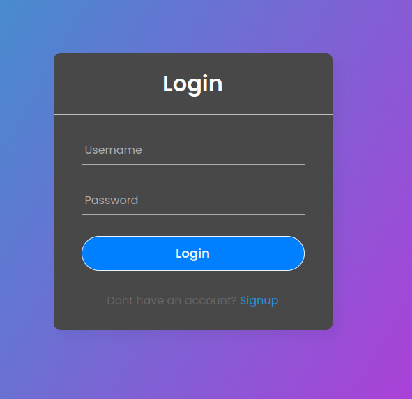
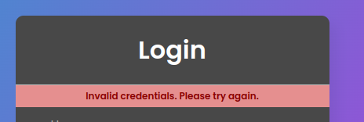
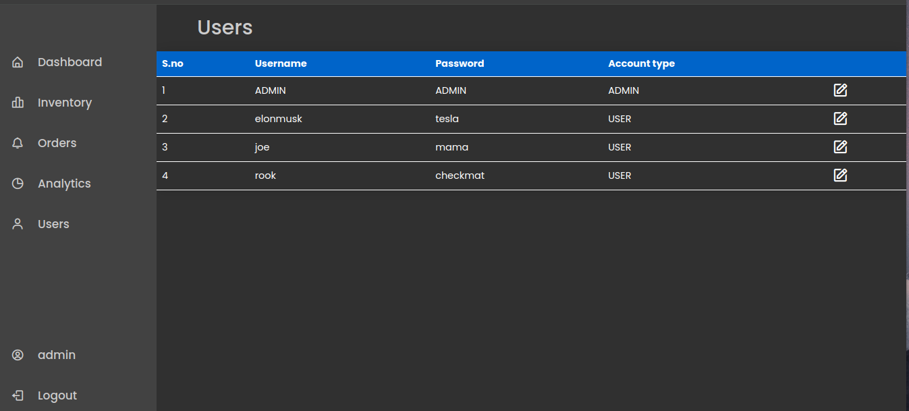
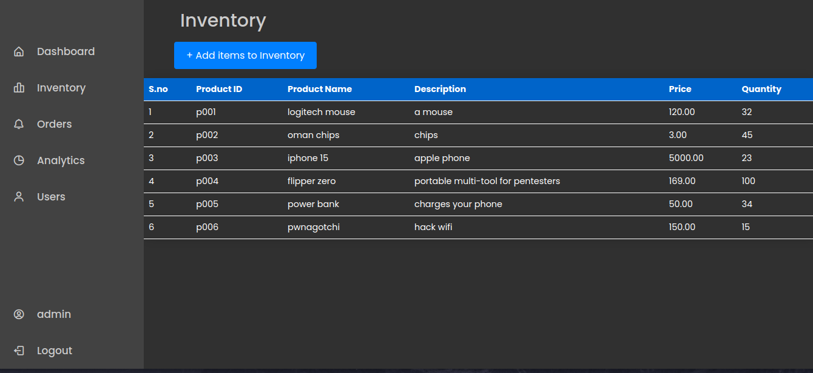
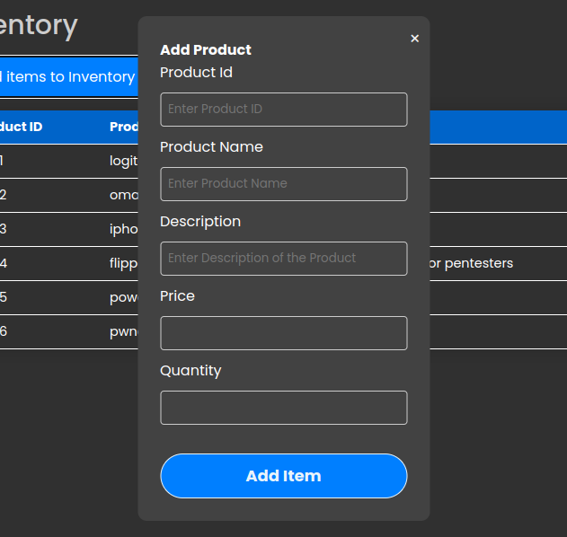
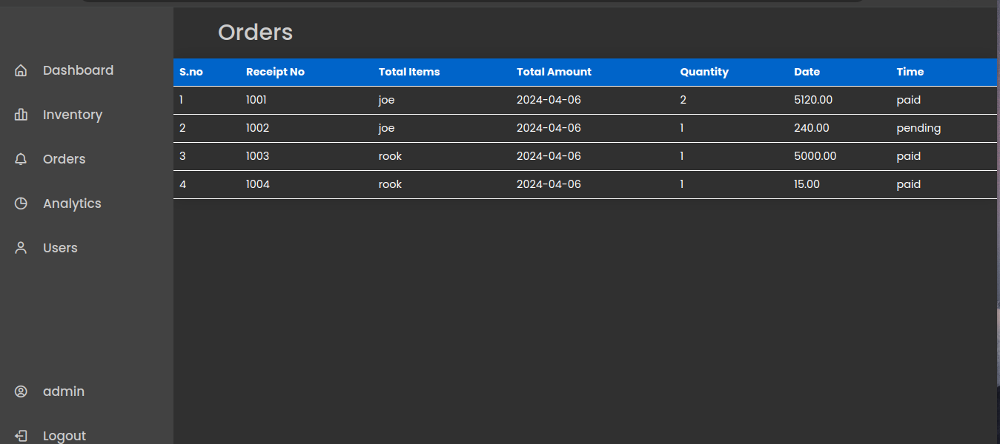

# inventory-management-web

**Note:** This project is incomplete. Some features may be missing or incomplete as i decide to switch to GUI instead of website .
[Click here to check out the GUI version](https://github.com/abidzzz/inventory-gui)

This repository is to reuse the login functionalities and other features which i have created with Flask and mysql

## Screenshots

<p align="left">
</image>
</image>
</image>
</image>
</image>
</image>

</p>

## Usage


1. Run the application:

    ```bash
    python3 app.py
    ```

2. Open your web browser and navigate to `http://127.0.0.1:4000/`.


## Contributing

Contributions are welcome! If you'd like to contribute to this project, please fork the repository and submit a pull request with your enhancements.

## License

This project is licensed under the [MIT License](LICENSE).

